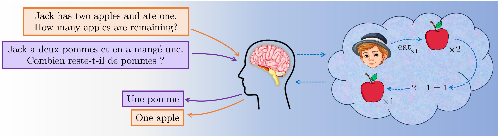

# Language Model Reasoning in Base64

<em>Repository for the blog post: [Language Model Reasoning in Base64]().</em>

## Introduction

<!--  -->

<p align="center">
  
  <small><em>Figure 1. An illustration of how certain types of reasoning is independent of language. A problem posed in English (orange) or French (purple) evokes the same reasoning process, leading to the same answer in different languages.</em></small>
</p>


Humans' abilities to solve math problems is independent of language -- if you can (or cannot) solve a problem stated in English, and if you understand, say French, you will (or will not) be able to solve the same problem presented to you in French (see Figure 1). This repository contains the code to run some experiments towards checking if the same holds for LLMs such as GPT-4o.

## Usage

```shell
python run_evaluation.py \
    --data_path $data_path \
    --out_root_dir $out_root_dir \
    --few_shot_data_path $few_shot_data_path \
    --temperature $temperature \
    --max_tokens $max_tokens \
    --num_threads $num_threads \
    --rpm_limit $rpm_limit \
    --num_examples $num_examples \
    --system_prompt $system_prompt \
    --evaluator $evaluator \
    --model_name $model_name \
    --few_shot_k $few_shot_k
```

At the moment, evaluations for two-operand addition are supported in English and base64 using few-shot or chain-of-thought prompting. 

The following configuarations correspond to the various experimental settings:
* `model_name`: `gpt-4o`
* `system_prompt` $\in$ `{assistant, base64_assistant, base64_cot_english_assistant, base64_cot_base64_assistant}`
* `evaluator` $\in$ `{english_evaluator, base64_evaluator, base64_cot_base64_evaluator, base64_cot_english_evaluator}`


## Data

All the data for the arithmetic evaluations is available at `data/arithmetic` which was prepared using the scripts in `data_preprocess/`. 

All the model outputs from GPT-4o are available at `model_outputs/arithmetic/`.


## Acknowledgements

The code in this repository is based on the [OpenAI simple-evals](https://github.com/openai/simple-evals).
